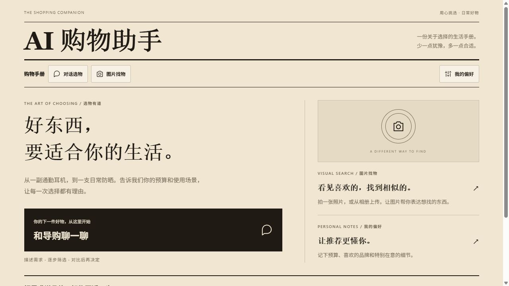
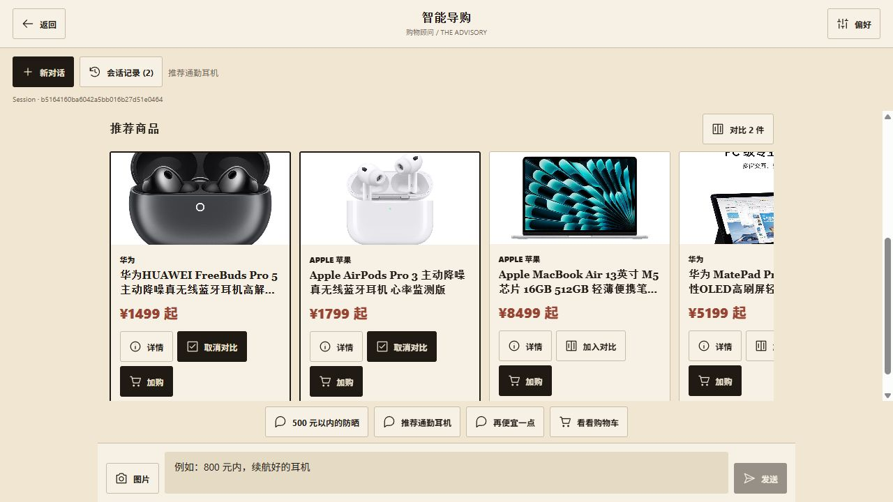
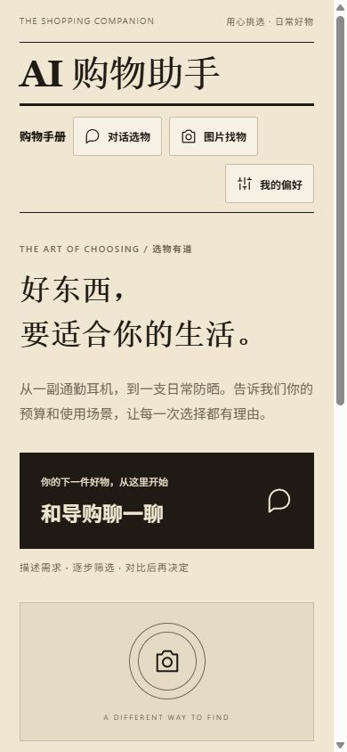
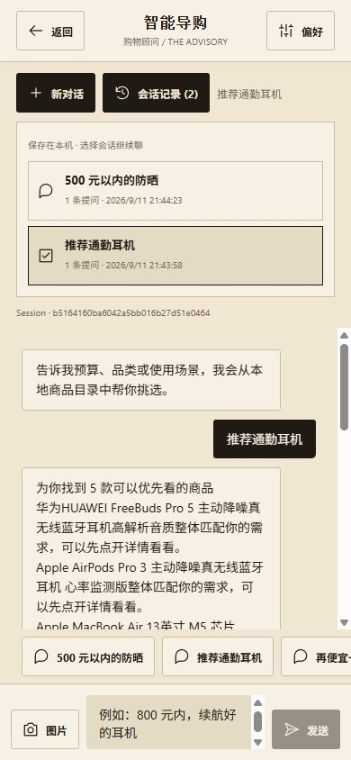

# AI 购物助手

AI 购物助手是一个面向学习与项目演示的多模态购物决策 Agent。用户可以通过文字或图片描述购物需求，系统会解析预算、品牌、品类和排除条件，从固定商品目录中检索候选商品，并完成推荐、追问、对比、详情查询和购物车操作。

项目重点不是模拟完整电商平台，而是展示一条可运行、可测试的 Agent 业务链路：**需求理解 → 商品检索 → 工具调用 → 多轮决策 → 客户端交互**。

## 界面展示

采用深棕 `#1f1a14` 与米白 `#f0e6d2` 配色，结合杂志式刊头、细线分栏和 SVG 操作按钮。以下均为实际运行截图，商品与价格来自本地演示目录。

**桌面首页**



**商品推荐与对比选择**



**移动端首页与会话记录**

<p>
  
  
</p>

通过「新对话」开启独立上下文；「会话记录」支持切换历史会话，并在本机保存消息、推荐结果和 Session。刷新后重新进入导购页可继续上次会话。

## 项目定位

本项目用于学习和展示垂直领域 Agent 的工程实现，主要关注以下问题：

- 如何将自然语言和图片输入转换为结构化购物条件；
- 如何在多轮对话中持续合并预算、品牌和排除条件；
- 如何让 Agent 根据用户意图选择检索、详情、对比或购物车工具；
- 如何将模型输出与 SQLite 中的商品事实分离，避免由模型生成价格等关键字段；
- 如何在没有模型密钥时保留可运行、可测试的本地降级链路。

仓库内包含 100 条固定演示商品数据，适合本地开发、功能演示和自动化测试。项目不接入京东、淘宝等实时平台，也不提供实时库存、全网比价或支付能力。

## 核心功能

| 功能 | 说明 |
| --- | --- |
| 文本推荐 | 根据品类、预算、品牌、属性和排除条件检索商品 |
| 图片输入 | 校验并解析 JPEG、PNG、WebP 图片，将识别结果接入推荐流程 |
| 多轮筛选 | 在同一会话中追加或修改预算、品牌、属性及负向条件 |
| 智能追问 | 需求信息不足时返回澄清问题，而不是直接给出不可靠推荐 |
| 商品详情 | 查询商品与 SKU 的结构化信息 |
| 商品对比 | 对 2～3 件商品进行字段化比较并生成说明 |
| 购物车 | 支持加入、删除、修改数量和查看购物车 |
| 用户偏好 | 保存跨会话的品牌、预算和属性偏好 |
| 流式响应 | Web 端通过 SSE 接收状态、工具结果和文本片段 |
| 安全降级 | 模型或向量检索不可用时，回退到规则路由和关键词检索 |

## 技术栈

| 模块 | 技术与职责 |
| --- | --- |
| 移动端 | React Native、Expo、TypeScript、React Navigation |
| API | FastAPI，提供对话、商品、对比、购物车和偏好接口 |
| Agent | Orchestrator、Intent Router 和领域工具集合 |
| 模型层 | 统一 `ChatModel` 接口、豆包 Ark Adapter、离线 Fake Adapter |
| 检索 | 默认关键词检索；可选 Chroma 向量检索和 Rerank |
| 数据存储 | SQLite，保存商品事实、会话、偏好和购物车 |
| 测试 | Pytest、Vitest、TypeScript 类型检查 |

## 系统架构

```text
React Native / Expo
        │
        ▼
FastAPI API (/chat, /chat/stream)
        │
        ▼
Agent Orchestrator → Intent Router → Tools
        │                         │
        ▼                         ▼
ChatModel Adapter          Search / Cart / Compare
        │                         │
        └─────────────┬───────────┘
                      ▼
             SQLite Product Facts
```

架构遵循两个基本原则：

1. SQLite 是商品标题、品牌、价格和 SKU 信息的事实来源，模型只负责理解、路由和表达。
2. 模型与检索能力均可替换或降级，外部服务不可用时不会阻止基础商品检索和自动化测试。

更详细的模块说明见 [架构文档](./docs/architecture.md)，接口字段与事件格式见 [API 文档](./docs/api.md)。

## 工作流程

一次典型购物请求会经过以下步骤：

1. 用户在客户端输入文字，或选择一张商品相关图片。
2. API 创建或恢复会话，并对图片类型、大小和来源进行安全校验。
3. Intent Router 判断当前意图属于推荐、继续筛选、详情、对比、购物车或澄清。
4. 查询理解模块提取品类、预算、品牌、属性和排除条件，并与会话上下文合并。
5. Search Service 使用默认关键词模式，或可选的 Hybrid 模式召回候选商品。
6. Agent 调用对应领域工具，并从 SQLite 回填可信商品字段。
7. API 返回结构化结果；客户端将商品、对比结果和购物车操作渲染为可交互界面。

## 项目结构

```text
.
├─ backend/
│  ├─ agent/          # Agent 编排、意图路由、工具和回答生成
│  ├─ api/            # 对话、SSE、商品、对比、购物车和偏好接口
│  ├─ llm/            # 模型抽象、豆包 Adapter 和测试 Adapter
│  ├─ search/         # 查询理解、关键词检索和过滤
│  ├─ rag/            # Chroma、向量检索和重排序
│  ├─ store/          # 商品、会话、偏好和购物车存储
│  ├─ eval/           # 路由、检索和一致性评测
│  └─ db/             # SQLite 初始化脚本
├─ mobile/            # React Native / Expo 客户端
├─ data/              # 100 条演示商品 JSON 数据
└─ docs/              # 架构、API、项目定位和实施说明
```

商品图片二进制文件已被 Git 忽略，不会随仓库克隆下载；仓库仅保留商品图片 URL 清单，图片展示依赖清单所指向的外部存储。

## 快速开始

### 环境要求

- Python 3.11
- Node.js 20 或更高版本
- npm

以下命令均从仓库根目录执行，示例环境为 Windows PowerShell。

### 1. 启动后端

```powershell
py -3.11 -m venv .venv
.\.venv\Scripts\python.exe -m pip install -r .\backend\requirements.txt
Copy-Item .\backend\.env.example .\.env

Set-Location .\backend
..\.venv\Scripts\python.exe -m store.import_product_data --reset
..\.venv\Scripts\python.exe -m store.import_image_manifest
..\.venv\Scripts\python.exe -m uvicorn main:app --host 127.0.0.1 --port 8000
```

启动后可访问：

- 健康检查：`http://127.0.0.1:8000/health`
- Swagger：`http://127.0.0.1:8000/docs`

### 2. 启动客户端

另开一个 PowerShell 窗口，在仓库根目录执行：

```powershell
Set-Location .\mobile
npm install
$env:EXPO_PUBLIC_API_URL="http://127.0.0.1:8000"
npm start
```

不同运行环境的后端地址：

| 环境 | API 地址 |
| --- | --- |
| Web / iOS 模拟器 | `http://127.0.0.1:8000` |
| Android 模拟器 | `http://10.0.2.2:8000` |
| 真机 | `http://<电脑局域网地址>:8000` |

真机调试时需要让后端监听 `0.0.0.0`，并确保手机能够访问电脑所在局域网。API 密钥保存在后端本机，不要写入移动端环境变量。

## 配置说明

模型可以直接通过首页「服务设置」配置，无需创建 `.env`：

1. 选择「豆包 / 火山方舟」或「OpenAI 兼容」。
2. 填写同一服务对应的 **Base URL、模型 ID、API Key**。Base URL 不要带 `/chat/completions`；套餐用户须使用套餐控制台提供的地址和模型，页面默认值只是普通 API 示例。
3. 点击「测试连接」检查当前填写的参数，再点击「保存配置」。测试本身不会保存，且只验证简单文本回复，不代表图片与工具调用均可用。
4. 返回导购开启新对话。保存后下一次请求使用新配置，无需重启；后端重启后也会恢复。

配置保存在根目录 `.local/model-config.json`（已被 Git 忽略）。配置查询不会返回密钥，浏览器也不再保存新密钥。仅修改模型 ID 时可留空 Key 保留原值；更换供应商或 Base URL 时需重新填写 Key。此设置接口面向本机单进程演示使用。

没有保存页面配置时，仍可复制 `backend/.env.example` 到根目录 `.env`，通过以下环境变量配置。页面保存的模型配置优先于环境变量：

| 配置 | 默认值 | 说明 |
| --- | --- | --- |
| `CHAT_PROVIDER` | `doubao` | 聊天模型供应商 |
| `CHAT_API_KEY` | 空 | 模型访问密钥 |
| `CHAT_BASE_URL` | 空 | 模型服务地址 |
| `CHAT_MODEL` | 空 | 模型或推理接入点 ID |
| `RETRIEVAL_MODE` | `lexical` | `lexical` 或 `hybrid` |
| `USE_RERANK` | `0` | 是否启用重排序 |
| `CHAT_IMAGE_ALLOWED_HOSTS` | 空 | 允许下载远程图片的域名列表；为空时仅接收上传图片 |

默认 `lexical` 模式不依赖 Embedding、Chroma 或 Rerank 服务。启用 `hybrid` 时，还需要配置 `EMBEDDING_*` 并建立非空 Chroma collection；启用 Rerank 时需要配置 `RERANK_*`。

豆包 Ark 的模型 ID、Base URL 和可用能力由使用者自己的部署决定，仓库不会预设真实凭据。

## 测试与验证

已完成真实火山 Agent Plan 本地验收，保留原始请求响应、链路耗时、商品事实核验和未通过项。最新结果见 [2026-09-16 真实模型验收报告](docs/validation/2026-09-16/REPORT.md)，前端截图见 [2026-09-13 验收记录](docs/validation/2026-09-13/REPORT.md)。这些都是小样本开发验收，不代表生产准确率或已上线运营。

运行后端测试：

```powershell
Set-Location .\backend
..\.venv\Scripts\python.exe -m pytest -q
```

运行客户端测试和类型检查：

```powershell
Set-Location .\mobile
npm test
npx tsc --noEmit
```

建议手工验证以下场景：

1. 输入“推荐一款 500 元以内、不要含酒精的防晒”。
2. 继续输入“预算改成 300 元，并排除某品牌”。
3. 查看商品详情并选择 2～3 件商品进行对比。
4. 将商品加入购物车，修改数量后重新读取购物车。
5. 上传一张小于 5 MB 的 JPEG、PNG 或 WebP 图片。
6. 停止后端，确认客户端显示可重试错误，而不是重复执行购物车操作。

## 项目边界

当前项目已经覆盖本地演示所需的主要链路，但仍有明确边界：

- 商品数据来自固定演示目录，不代表实时价格、库存或平台可购买状态；
- 商品图片二进制未随 Git 仓库分发，现有图片 URL 的可用性取决于外部存储；
- Hybrid 检索、Rerank 和真实豆包调用需要有效的外部服务配置；
- 尚未实现真实平台采集、跨平台 SKU 对齐、支付和订单系统；
- 尚未实现正式用户认证、多租户隔离、生产部署和完整可观测性。

## 相关文档

- [系统架构](./docs/architecture.md)
- [API 说明](./docs/api.md)
- [项目定位](./docs/project-positioning.md)
- [项目状态与后续计划](./docs/project_status_and_next_steps.md)
- [真实商品数据接入方案](./docs/real_data_integration_plan.md)
