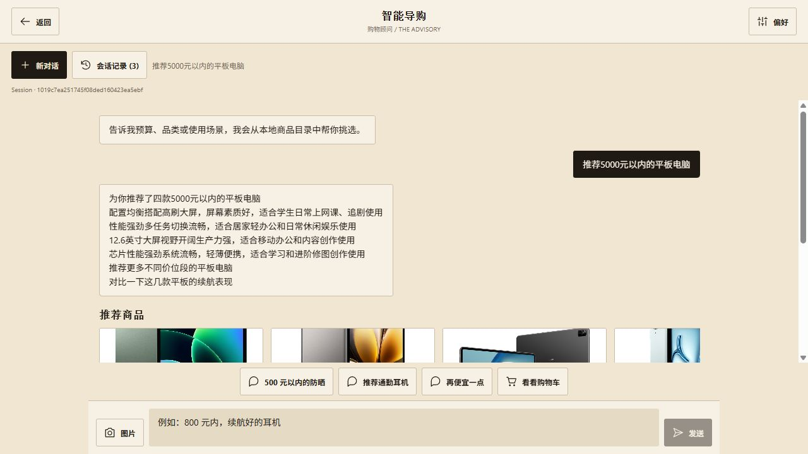
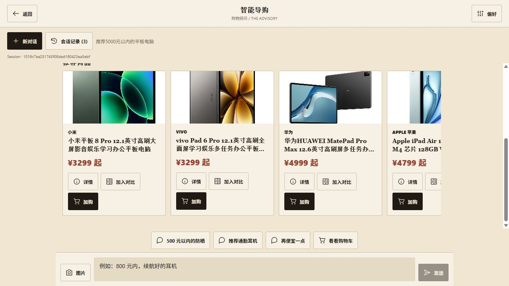

# 真实模型运行验收记录

测试日期：2026-09-13；补测与报告整理：2026-09-14（北京时间）。

## 结论与适用范围

项目已具备真实模型驱动的本地文本导购运行证据，可用于展示推荐、预算调整、品牌排除、上下文指代、详情查询和澄清链路。图片找物的检索相关性、对比字段完整性与生成文案的证据约束尚未通过完整业务验收，不能宣称全功能已落地。

本次是开发者设计的小样本探索验收，单次串行运行，非独立测试集、非生产压测、非真实用户研究。HTTP 200 仅表示接口返回，不作为整体业务成功标准。

## 环境与证据

- 实际模型入口：火山 Agent Plan，`ark-code-latest`，`https://ark.cn-beijing.volces.com/api/plan/v3`。这是路由别名，未获知服务端最终分配的具体模型版本。
- 后端：本机 FastAPI；通过运行中的 `/chat` 和 `/chat/stream` 调用，未注入 Fake Adapter。
- 主导购商品库：SQLite 中 100 条固定演示商品。另有 Myntra 数据文件，不能将其 44,446 条记录计为主导购检索规模。
- 结果中的价格为演示库 SKU 价格，不代表当前真实市场售价或库存。
- 模型配置来源为后端已保存配置；证据不包含 API Key。
- [运行清单](suite/manifest.json)、[逐卡片核验](verified-metrics.json)、[离线测试输出](offline-tests.txt)。
- 请求、响应、trace 和耗时完整保留在各 JSON 中；图片结果保留原始 SSE。测试过程没有剔除不理想的输出。

## 用例与实际结果

| 场景 | 实际结果 | 耗时 | 评价 |
| --- | --- | ---: | --- |
| [500 元内防晒推荐](suite/recommend.json) | 3 款，118 / 170 / 268 元 | 19.808 s | 路由、商品与预算通过；文案存在过度承诺 |
| [对比前两款](suite/compare.json) | 正确定位安热沙与欧莱雅，返回对比表 | 5.636 s | 指代通过；四个业务维度为“—”，完整性未通过 |
| [第一款优缺点](suite/detail.json) | 正确定位安热沙，返回总结、优点、缺点 | 19.934 s | 路由与指代通过；内容需继续逐项核对证据 |
| [预算改为 200 元](suite/refine.json) | 保留防晒需求，缩减为 118 / 170 元两款 | 16.573 s | 预算与上下文保持通过 |
| [排除安热沙](suite/negative.json) | 只返回欧莱雅和理肤泉 | 26.984 s | 品牌排除与预算通过 |
| [5000 元内平板](suite/digital.json) | 返回 4 款，3299 / 4999 / 4799 / 3299 元 | 26.259 s | 商品类别、预算与结构化输出通过 |
| [10 元内笔记本](suite/empty_results.json) | 空商品列表，说明未找到并建议放宽条件 | 22.951 s | 无结果处理通过 |
| [模糊需求补测](clarify-followup.json) | 路由 clarify，追问品类、预算与偏好 | 3.889 s | 通过 |
| [非购物请求](suite/out_of_scope.json) | 路由 fallback，说明能力范围 | 3.884 s | 通过 |
| [空输入](suite/clarify.json) | HTTP 400 | 0.001 s | 输入校验符合接口约定；原测试误标为 clarify，脚本已更正 |
| [图片找物](suite/image.json) | 识别为浅蓝色牛仔短裙，但返回 T 恤、护肤水、手机和平板 | 36.929 s | 识别链路可运行；检索相关性失败 |
| [先行耳机探测](01-recommend.json) | 500 元内耳机未命中，未编造商品 | 24.234 s | 保留探索记录，不计入下列统计 |

## 可复核指标

- 9 条有效文本用例中，预期工具与实际路由一致：9/9。覆盖 recommend、refine、compare、product_detail、clarify、fallback 六类；未覆盖 cart 路由。
- 四个非空推荐/筛选响应共返回 11 次商品卡片（包含重复商品），11/11 的 ID 存在、标题匹配、显示价格属于对应 SKU 价格、未超出请求预算。不是 11 个不同商品，也不是文案事实准确率。
- 上述 9 条有效文本用例端到端耗时：最小 3.884 秒，中位数 19.808 秒，最大 26.984 秒。包含路由、业务工具、必要的模型生成和 HTTP 往返；不是首 token 时间，样本量不足以报告稳定 P95。
- 9 条文本响应 trace 未报告 router_error、tool_error 或 composer_error。该证据不能证明所有内部可选组件均启用或没有降级。
- 离线全量回归：327 passed、7 skipped、5 warnings。跳过项不计通过，警告为现有弃用提醒。曾出现 4 项失败，原因是本机持久化配置进入离线测试；新增 pytest 配置隔离后复测通过。

## 已发现的问题与下一步验收条件

1. **图片召回不相关**：识别词“短裙”没有形成有效品类约束，候选池跨品类，最终输出仍称其为相似商品。应修复解析失败/无同类库存时的处理，再用有同类与无同类商品的多张图片复测。当前不能写“实现高准确率以图搜商品”。
2. **对比信息缺失**：价格之外四个维度没有抽出值，也没有推荐结论。应核对商品规格字段与比较器映射；资料缺失要明确展示，不能生成补齐。
3. **生成文案过度承诺**：出现“温和不刺激”“不怕晒黑”等措辞。商品结构化事实检查不代表这类自然语言主张已获证据支持，应增加文案约束与人工标注验收。
4. **响应时间**：多次文本请求接近客户端 30 秒超时；图片请求总耗时超过 30 秒。需要测 SSE 首事件/首 token/完成时间，验证客户端超时处理。
5. 尚未验证真实购物车完整交互、并发、长时间稳定性、真实用户效果、线上部署、实际模型成本及支付闭环。Embedding、向量检索和 Rerank 不纳入已验证能力。

## 复现步骤

### 前端真实运行截图

2026-09-14 在浏览器新建会话，实际发送“推荐5000元以内的平板电脑”，收到四款商品和模型解说；Session 为 `1019c7ea251745f08ded160423ea5ebf`。这是额外的前端 SSE 验证，不计入上面的九条文本接口统计。





### 命令行复现

1. 启动可联网的后端：在 `backend` 目录执行 `..\.venv\Scripts\python.exe -m uvicorn main:app --host 127.0.0.1 --port 8000`。
2. 在前端服务设置中保存可用模型配置，测试连接成功。不要把密钥加入证据文件。
3. 在仓库根目录执行下面命令，使用新输出目录保存下一轮，避免覆盖原始记录：

```powershell
.\.venv\Scripts\python.exe backend/eval/live_acceptance.py --output docs/validation/next-run --image dataset/myntradataset/images/10001.jpg
.\.venv\Scripts\python.exe -m pytest backend -q
```

当前脚本比首轮多一个明确的模糊需求用例，合计 11 条；首轮原文件 10 条，另有模糊需求补测。图片可选，运行会把指定图片送往已配置的模型，并消耗套餐额度。脚本每次生成独立 session/user 标识，不读取用户旧会话。

## 简历展示口径

可写：完成真实模型 API 接入与本地导购验收，基于 100 条演示商品实现需求推荐、多轮预算调整、品牌排除和商品指代查询；留存请求响应与链路耗时，9 条文本验收样本路由符合预期，11 次返回商品卡片通过 ID、价格及预算一致性核验。

推荐将“327 项离线测试通过”与“9 条真实模型文本样本验收”分开表述。不要写上线运营、真实用户转化率、全库 4 万商品检索、模型准确率 100%、图片检索验收通过或生产级高并发。
